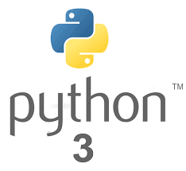
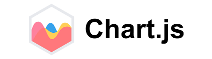
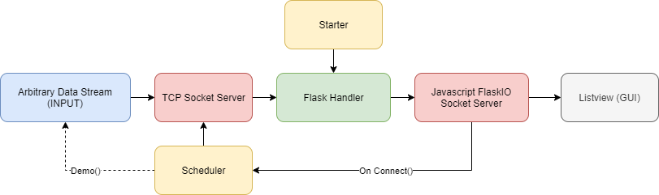
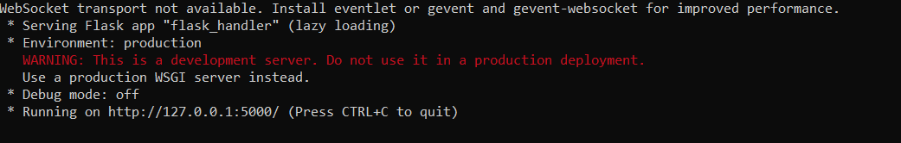

# Automatic Visualization of Realtime Data Stream Charts in Flask
 Visualize arbitrary realtime data streams with just a few lines of code!


<details>
  <summary><strong>Table of Contents</strong> (click to expand)</summary>

<!-- toc -->

- [About](#About)
- [Solution](#Solution)
- [Getting-Started](#Getting-Started)
- [How-to-Send-data-to-your-Server](#How-to-Send-data-to-your-Server)
- [Docker](#Docker)
- [Demo](#demo)
- [Examples](#examples)
- [What-is-flask?](#What-is-flask?)
- [What-is-JSChart?](#What-is-Chart.JS?)
- [License](#license)
- [Sources](#sources)

<!-- tocstop -->
</details>

# About
Visualizing data flows are important in a project where maintaining data streams are of priority.
The abiliy to visualize data in realtime can contribute with huge advantages while debugging code or demonstrating. In this implementation we are visualizing data in charts using Chart.JS, a simple powerful library for creating charts in Javascript. The server can now also visualize image streams and heatmaps using Plotly, a modern analytics app for enterprises. This implementation utilizes Flask and is developed mainly in python3 and Javascript.

<p align="center" >
  
  
  
</p>
<p align="center" >
  
  
</p>

## Solution
This implementation is started by running the `main.py` file. The `Starter` will then set a timer for triggering the webbrowser after one second and then start the `Flask Handler`. The `Flask Handler` will start the website containing a `Flask-SocketIO` server. The `Flask-Server` will receive json objects and update the `GUI` listview. When the `Flask-Server` is started the `Scheduler` will be triggered. The `Scheduler` will start the middle-man servers consisting of a `TCP Socket Server`, a `TCP Socket Server for large files` and a `HTTP Server` which has the purpose of receiving messages and proxy them to the flask server. In the `demo` we also start some data streams with the scheduler. You basicly have two alternatives on sending data to this implementation. Either create a data stream in the `scheduler` or create a seperate `tcp socket client` or `http client` and send data to the tcp socket server while running. See examples.

See program structure image below:


# Getting Started
1. Install program by firstly installing all the required packages in python3:
**Note**: If you want to use docker see [here](#Docker).
```
pip install -r requirements.txt
```

2. Start the implementation by running:
```
python3 main.py
```

3. If the website doesn't open automatically, open a webbrowser of your choice and go to: `https://127.0.0.1:5000/`

4. Edit the `Scheduler` file and Comment the `demo()` line, to make sure the demo data streams won't start.

5. Create your stream by looking at the [heading below](#How-to-Send-data-to-your-Server).

Example data json:
```
data = {
  "id":1337, 
  "value": [1,1], 
  "type":"line",
  "active_points": 20,
  "label":"Label",
  "legend": ["one", "two"],
  "name":"Example",
  "borderColor":["#3e95cd", "#e8c3b9"],
  "backgroundColor":["#3e95cd","#e8c3b9"],
  "api_crypt":"password-1"
  }      
```

# Change Config
Ports and addresses can be changed in the `config.ini` file.

# How to Send data to your Server
As mentioned in the [solution heading above](#Solution) there are two ways of sending data streams to this implementation, creating a socket client or creating data stream in the implementation.

## Create a seperate TCP Socket Client
I created two simple example of tcp socket clients in `examples/`. One that creates a data stream from live stock share prices and one that create a data stream from random numbers.

## Using the scheduler
Take a closer look at the `scheduler.py` file, where more functions can be added to server start. In the current implementation there are two stream examples using scheduler in the `demo()` function.

The first one is a seperate tcp socket client started from the scheduler. Check out the scheduler and `socket_client.py`. The second one is a stream using the `DataStream` class. Check out `data_streams/samples.py`.

## Showing RTSP Streams
To create a video feed send a json with rtsp address as value and a unique id. Example:
```
video_data= {
            'id': 12,
            'value': rtsp://192.168.0.25:554/live.sdp,
            'type': 'video_stream',
            'name': 'Video Stream HTTP Example',
            # Crypt password from config.ini
            'api_crypt':CRYPT 
        }
```

# Docker
1. Build the docker image for this project by running:
```
docker build . --tag="JSChart-flask:1.0"
```
2. Run the image in background by running:
```
docker run -d -p 80:80 JSChart-flask:1.0
```

2. Or Run image in interactive mode by running:
```
docker run -it -p 80:80 JSChart-flask:1.0
```

3. Open your webbrowser of choice and go to:
```
http://127.0.0.1/
or
http://localhost/
```
**Note**: all ports and addresses can be changed in `config.ini`
# Demo

This is the output on the console during execution.


This is how the implementation looks like during execution of the `demo()`.


Examples of how each chart look and how the data should be represented in json see:
* https://www.chartjs.org/samples/latest/
* https://tobiasahlin.com/blog/chartjs-charts-to-get-you-started

## What is flask?
[Flask](https://en.wikipedia.org/wiki/Flask_(web_framework)) is a micro web framework, enabling websites to be hosted in python.

## What is Chart.JS?
[Chart.JS](https://www.chartjs.org/) is an opensource project with the main purpose to provide awesome charts for html5 and javascript.

## What is Plotly?
[Plotly](https://plot.ly/) is a collection of open source Graphing Libraries for visualizing data in a vast amount of formats.

# Licenses
See 

# Known Issues
List of known issues:
* Ignore the `WebSocket transport not available. Install eventlet or gevent and gevent-websocket for improved performance.` warning as eventlet doesn't support Flask-socketio! Make sure eventlet is not installed in your python environment!

# Sources
The main inspiration and solutions comes from the following sources:
* https://gitlab.com/patkennedy79/flask_chartjs_example
* https://github.com/roniemartinez/real-time-charts-with-flask

# Deprecated Demo
A deprecated demo can be intresting to see how the application has developed from earlier versions!


# TODO
These are functions that I will add
* geo tagging free api map
* 3d graphs
* 3d algoritm
* Bubble matrix
* Tree
